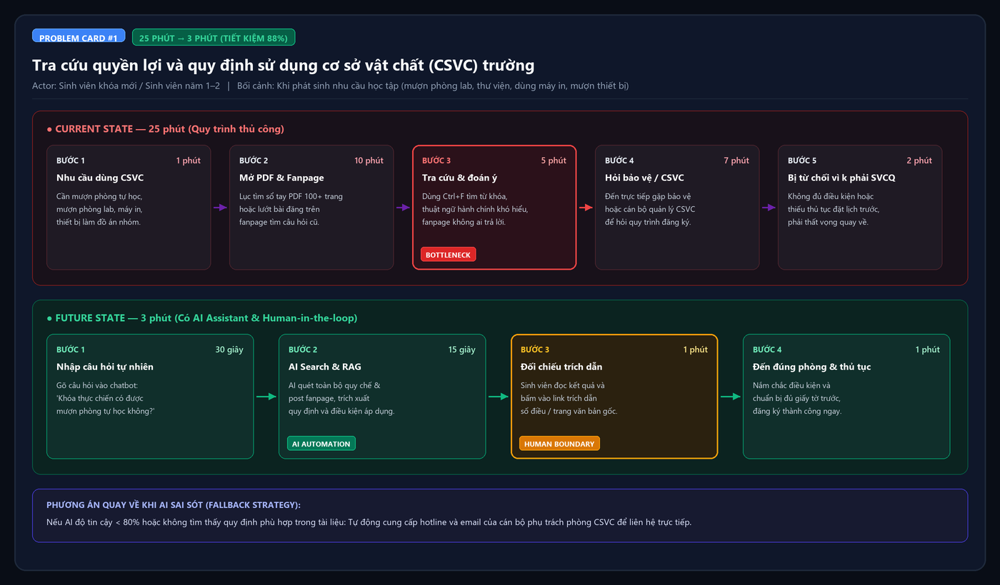
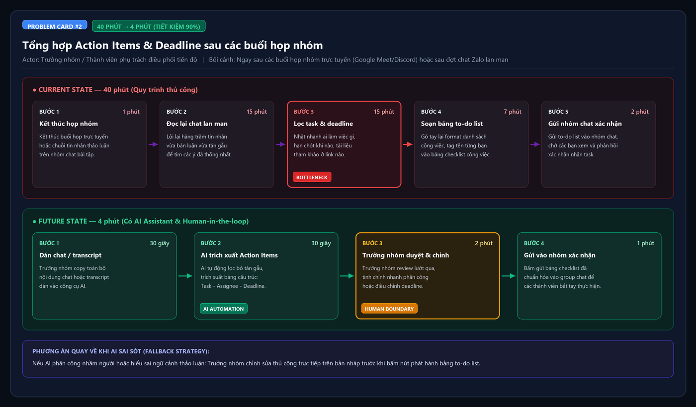
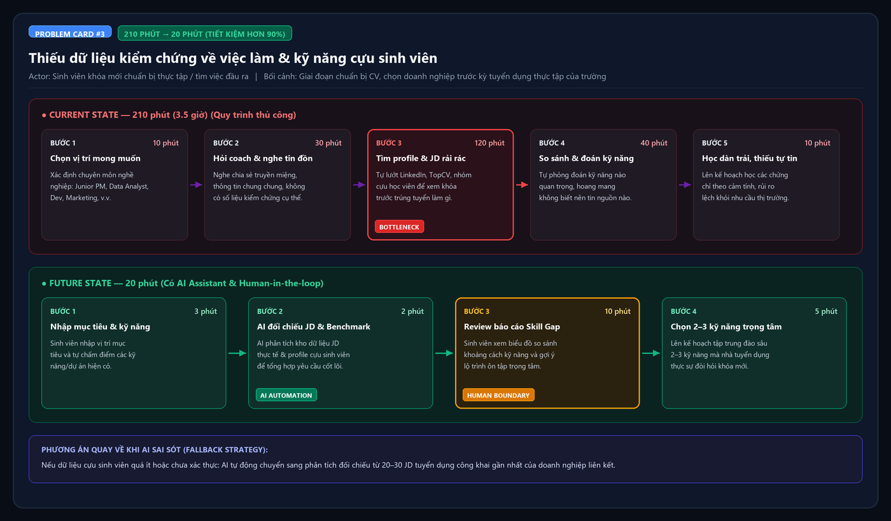

# 01 — Individual Problem Scan

> Điền theo Phase 1 + Phase 2 trong `01-worksheet.md`. Tự scan trước, dùng AI sau để phản biện. Không copy ví dụ Weekly Report.

## Thông tin cá nhân

- Họ và tên: Đinh Văn Bình
- Mã học viên: 2A202602830
- Vai trò / bối cảnh : sinh viên năm 4
- Công việc hằng tuần (3-5 gạch đầu dòng để soi problem):
  - Di chuyển đi học bằng xe bus công cộng từ nhà đến trường (phải chuyển tiếp từ 2 tuyến trở lên).
  - Đi học trên lớp các môn chuyên ngành, điểm danh QR code theo từng ca học.
  - Họp nhóm thảo luận bài tập lớn / đồ án hàng tuần qua Google Meet và nhóm chat.
  - Chuẩn bị hồ sơ thực tập tốt nghiệp, tìm hiểu yêu cầu tuyển dụng và cơ hội việc làm từ cựu sinh viên.
  - Tự học và sử dụng các tiện ích, cơ sở vật chất tại trường (thư viện, phòng tự học, máy in).

---

## Phase 1 — Scan 5+ problems (tối thiểu 5, khuyến khích 8-10)

**Cách điền:** mỗi dòng = việc gì + ai chịu + đo bằng gì. Cột `Dấu hiệu thật` bắt buộc có số: mất bao lâu (bấm giờ mấy lần), mấy lần/tuần, bao nhiêu người gặp, log/ticket/quote nào.

| # | Lăng kính (Lặp lại / Tốn thời gian / AI có thể tốt hơn / Pain từ người khác) | Problem quan sát được | Ai chịu ảnh hưởng? | Dấu hiệu thật (số + bằng chứng) |
|---|---|---|---|---|
| 1 | Tốn thời gian | Khó theo dõi và đón tuyến xe bus chuyển tiếp real-time khi lộ trình đi học cần đổi từ 2 tuyến trở lên, phải mở app tra cứu liên tục ở từng trạm. | Sinh viên di chuyển bằng xe bus công cộng có chuyển tuyến | Mất 5–7' mỗi chuyến để canh app; lỡ tuyến 1–2 lần/tuần dẫn đến trễ học 5–10'. |
| 2 | Lặp lại | Sinh viên dễ bị quên check-in do mật độ điểm danh QR quá dày đặc (4 lần/ngày theo ca), dẫn đến nguy cơ bị trừ điểm chuyên cần dù có mặt trên lớp. | Sinh viên, cán bộ quản lý chuyên cần / giảng viên | Trung bình 1 lần/tháng bị quên quét 1 chặng; mất 2–3 ngày làm đơn xin xác nhận lại; 5–10 bạn trong lớp gặp lỗi tương tự mỗi kỳ. |
| 3 | AI có thể tốt hơn | Sinh viên ở xa phải bỏ lỡ workshop buổi tối vì xe bus về mất 1.5–2 tiếng và có khoảng trống 2 tiếng sau giờ học, nhưng thiếu bản tóm tắt/recap cô đọng để tự học lại. | Sinh viên ngoại thành / đi xe bus, Ban tổ chức workshop | Bỏ lỡ ~80% workshop sau giờ học; lãng phí 2 tiếng dead-time nếu ở lại đợi; workshop vắng 30% người đăng ký. |
| 4 | AI có thể tốt hơn | Quy định về quyền lợi sinh viên và việc sử dụng cơ sở vật chất (phòng lab, thư viện, khu tự học, máy in) bị phân tán trong nhiều file PDF, khó tra cứu nhanh khi cần. | Sinh viên (nhất là khóa mới)| Mất 15–20' lục tìm tài liệu; ít nhất 1–2 lần/kỳ bị từ chối vào phòng do không rõ quy định; 70% sinh viên không biết hết quyền lợi CSVC. |
| 5 | Tốn thời gian | Thiếu nguồn dữ liệu khách quan, có kiểm chứng về kết quả việc làm thực tế (skill set, vị trí, công ty) của cựu sinh viên các khóa trước để định hướng ôn tập. | Sinh viên khóa mới | Mất 3–4h/tuần lục lọi hội nhóm; 80% thông tin nhận được là truyền miệng một chiều chưa kiểm chứng. |
| 6 | Lặp lại | Họp nhóm xong mất nhiều công sức để tổng hợp lại các đoạn chat lan man thành danh sách to-do list và phân công deadline rõ ràng. | Trưởng nhóm, thành viên nhóm | Mất 30–45'/buổi họp để tóm tắt task; 1–2 task bị sót hoặc trùng mỗi sprint bài tập. |
| 7 | Pain từ người khác | Đọc slide bài giảng dài 60–80 trang trước mỗi buổi học để tìm phần trọng tâm cần chuẩn bị câu hỏi thảo luận, dễ bị ngợp và quá tải thông tin. | Sinh viên các môn chuyên ngành | Mất 45–60'/môn để lọc ý chính; 70% sinh viên trong lớp thừa nhận không đọc trước bài vì quá dài. |


**AI đã dùng ở Phase 1 (nếu có):**
- Prompt đã hỏi: Xem 7 vấn đề gặp phải có hợp để đưa vào Phase 1 không (xe bus chuyển tiếp, điểm danh QR 4 lần, lịch workshop lệch, thông tin quyền lợi trường, kết quả việc làm cựu sinh viên, mất thời gian tổng hợp khi họp nhóm, tìm trọng tâm slide) và điều chỉnh như thế nào.
- Ý dùng được: Giữ 7 vấn đề cốt lõi nhưng chuẩn hóa từ 'than phiền chính sách/thiếu app' thành 'điểm nghẽn quy trình' kèm số liệu đo lường cụ thể (thời gian, tần suất, tỷ lệ).
- Ý bỏ vì không phải pain thật: Bỏ góc nhìn coi 'điểm danh QR 4 lần' và 'lịch workshop cách 2 tiếng' là lỗi của nhà trường/BTC, chuyển trọng tâm thành rủi ro quên check-in và rào cản tiếp cận kiến thức của sinh viên ở xa.

**Self-check Phase 1:**
- [x] Đủ 5+ dòng, mỗi dòng có actor + số đo cụ thể
- [x] Dùng ít nhất 3/4 lăng kính
- [x] Không có dòng chung chung kiểu "mất nhiều thời gian"

---

## Phase 2 — Top 3 Problem Cards

### 2.1. Chọn top 3

Giữ bài nào: actor cụ thể, workflow vẽ được 3-7 bước, bottleneck ở 1 bước, impact đo được. Loại bài quá rộng.

| Rank | Problem (copy từ bảng scan) | Vì sao chọn (2-3 ý) | Điều còn chưa chắc |
|---|---|---|---|
| 1 | Quy định về quyền lợi sinh viên và việc sử dụng cơ sở vật chất (phòng lab, thư viện, khu tự học, máy in) bị phân tán trong nhiều file PDF, khó tra cứu nhanh khi cần. | 1. Nỗi đau thật của 100% sinh viên khi cần dùng tiện ích trường.<br>2. Workflow rõ (5 bước), bottleneck ở bước tra PDF.<br>3. Cực kỳ phù hợp với GenAI/RAG Search. | Quy định của trường có được số hóa và cấp quyền truy cập văn bản đầy đủ không. |
| 2 | Họp nhóm xong mất nhiều công sức để tổng hợp lại các đoạn chat lan man thành danh sách to-do list và phân công deadline rõ ràng. | 1. Tần suất lặp lại cao trong mọi môn học.<br>2. Metric đo lường rất sắc bén (giảm từ 40' xuống 4').<br>3. Ranh giới human-in-the-loop (trưởng nhóm review) rõ ràng. | Format tin nhắn chat tự do của sinh viên đôi khi viết tắt, teencode khiến AI khó trích xuất chính xác. |
| 3 | Thiếu nguồn dữ liệu khách quan, có kiểm chứng về kết quả việc làm thực tế (skill set, vị trí, công ty) của cựu sinh viên các khóa trước để định hướng ôn tập. | 1. Insight sâu, đánh trúng tâm lý hoang mang của sinh viên năm 3-4.<br>2. Giải quyết bài toán định hướng bằng data thay vì truyền miệng.<br>3. Khả năng pitch thuyết phục cả nhóm cao. | Thu thập dữ liệu việc làm cựu sinh viên trên quy mô đủ lớn để AI phân tích chính xác. |

### 2.2. Problem Cards chi tiết (lặp lại cho cả 3 cards)

---

#### Problem Card #1 — Tra cứu quyền lợi và quy định sử dụng cơ sở vật chất (CSVC) của trường

```text
Problem 1 câu:
Sinh viên (đặc biệt khóa mới) mất trung bình 15–20 phút tìm kiếm quy chế CSVC phân tán trong các file PDF dài hoặc trên các hội nhóm nhưng vẫn không rõ thủ tục, dẫn đến việc bị từ chối hoặc bỏ lỡ tiện ích học tập miễn phí.

Actor:
Sinh viên các khóa (nhất là sinh viên mới vào trường).

Thời điểm / bối cảnh:
Khi bắt đầu các khóa đào tạo khi phát sinh nhu cầu học tập/nghiên cứu đột xuất (cần mượn phòng tự học nhóm, phòng lab, thư viện, dùng máy in, mượn thiết bị).

Current workflow 3-7 bước:
1. Phát sinh nhu cầu sử dụng CSVC trường (mượn phòng/thiết bị).
2. Tải và mở sổ tay sinh viên PDF hoặc lướt web/fanpage trường.
3. Dùng Ctrl+F tìm từ khóa nhưng gặp thuật ngữ hành chính khó hiểu hoặc văn bản cũ.
4. Đến hỏi trực tiếp bảo vệ hoặc cán bộ phụ trách phòng CSVC.
5. Bị từ chối do thiếu không phải svcq.

Bottleneck:
Bước 2 & 3 — Đọc và tra cứu quy định trong file PDF dài, thuật ngữ khó hiểu, tốn 15 phút mà vẫn không chắc chắn. Mở fanpage tìm câu hỏi tương tự nhưng k có hoặc k ai trả lời.

Impact:
Mất 15–20 phút/lần tra cứu; 1–2 lần/kỳ bị từ chối vào phòng; 70% sinh viên khóa thực chiến không biết hết quyền lợi CSVC mà mình được hưởng.

Success metric:
Giảm thời gian tra cứu từ 20 phút xuống dưới 1 phút; 100% câu trả lời có trích dẫn đúng số điều, trang tài liệu quy định gốc hoặc câu trả lời từ admin trên fanpage.

Non-AI alternative:
Tạo trang web FAQ tĩnh hoặc tài liệu tóm tắt dạng infographic; tuy nhiên FAQ tĩnh khó bao quát hết câu hỏi ngữ cảnh tự nhiên và khó cập nhật khi quy chế đổi.

AI hypothesis:
AI đóng vai trò trợ lý hỏi đáp (Semantic Search / RAG), đọc hiểu toàn bộ quy chế PDF, trả lời ngay thắc mắc của sinh viên bằng ngôn ngữ tự nhiên kèm trích dẫn văn bản gốc.

Quick gut:
[ ] No AI / process fix
[ ] Rule
[x] Workflow
[ ] Agent
[ ] Chưa biết
```

**Draft workflow Card #1** (ASCII / Mermaid / ảnh đính kèm):

```text
CURRENT STATE — 25 phút

[1 Nhu cầu dùng CSVC: 1']
→ [2 Mở & đọc PDF sổ tay lên fanpage: 10']
→ [3 Tra cứu từ khóa & đoán ý quy định: 5']  <-- bottleneck
→ [4 Đến hỏi trực tiếp bảo vệ/phòng ban: 7']
→ [5 Bị từ chối vì k phải svcq, quay về: 2']

FUTURE STATE — 3 phút

[1 Nhập câu hỏi tự nhiên vào chatbot: 30s]
→ [2 AI search văn bản & trích dẫn quy định: 15s]
→ [3 Sinh viên đọc câu trả lời & xem link trích dẫn: 1']  <-- human boundary
→ [4 Đến đúng phòng theo đúng thủ tục: 1']

Fallback: nếu AI không chắc chắn hoặc không tìm thấy quy định phù hợp → Hiển thị số điện thoại/email cán bộ CSVC phụ trách để liên hệ trực tiếp.
```

File đính kèm (nếu vẽ riêng): `01-individual-problem-scan-workflow-card-1.png`



---

#### Problem Card #2 — Tổng hợp Action Items & Deadline sau họp nhóm

```text
Problem 1 câu:
Trưởng nhóm mất 30–45 phút sau mỗi buổi họp để lọc thủ công từ các đoạn chat lan man thành danh sách to-do list rõ ràng, dễ bỏ sót hoặc phân công nhầm deadline.

Actor:
Trưởng nhóm hoặc thành viên phụ trách tổng hợp tiến độ bài tập nhóm.

Thời điểm / bối cảnh:
Ngay sau các buổi họp nhóm trực tuyến (Google Meet/Discord) hoặc sau các đợt thảo luận dồn dập trong nhóm chat Zalo/Messenger.

Current workflow 3-7 bước:
1. Kết thúc buổi họp/thảo luận nhóm.
2. Đọc lại toàn bộ tin nhắn chat hoặc nghe lại ghi âm buổi họp.
3. Ghi chép nháp các đầu việc, người nhận việc và hạn nộp rải rác.
4. Lọc bỏ các trao đổi tán gẫu ngoài lề, chuẩn hóa format thành checklist công việc.
5. Gửi bản to-do list vào nhóm chat để các thành viên xác nhận.

Bottleneck:
Bước 3 & 4 — Lọc thông tin từ luồng trò chuyện lộn xộn và chuẩn hóa thành task mất 20–30 phút, rất dễ bị sót đầu việc quan trọng.

Impact:
Mất 30–45 phút/buổi họp cho trưởng nhóm; trung bình 1–2 task bị trễ hạn hoặc làm trùng nhau trong mỗi sprint bài tập nhóm.

Success metric:
Giảm thời gian tổng hợp to-do list từ 40 phút xuống dưới 4 phút; 0 trường hợp bị sót task hoặc nhầm người phụ trách sau khi trưởng nhóm duyệt.

Non-AI alternative:
Quy định form Google Sheets mẫu để thành viên tự điền trong lúc họp; nhưng thực tế thành viên thường lười cập nhật và form dễ bị bỏ hoang.

AI hypothesis:
AI đọc transcript cuộc họp hoặc đoạn chat copy-paste, tự động phân loại và trích xuất bảng: [Task] | [Người phụ trách] | [Deadline]. Trưởng nhóm chỉ duyệt lại (human-in-the-loop).

Quick gut:
[ ] No AI / process fix
[ ] Rule
[x] Workflow
[ ] Agent
[ ] Chưa biết
```

**Draft workflow Card #2:**

```text
CURRENT STATE — 40 phút

[1 Kết thúc họp: 1']
→ [2 Đọc lại tin nhắn chat lan man: 15']
→ [3 Lọc task, người phụ trách, deadline: 15']  <-- bottleneck
→ [4 Soạn bảng to-do list: 7']
→ [5 Gửi nhóm chat để confirm: 2']

FUTURE STATE — 4 phút

[1 Copy đoạn chat/transcript ném vào tool: 30s]
→ [2 AI trích xuất bảng Action Items có cấu trúc: 30s]
→ [3 Trưởng nhóm review & chỉnh sửa nhanh: 2']  <-- human boundary
→ [4 Gửi vào nhóm xác nhận: 1']

Fallback: nếu AI phân công nhầm người hoặc hiểu sai ý thảo luận → Trưởng nhóm chỉnh sửa thủ công trên bảng nháp trước khi bấm gửi.
```

File đính kèm: `01-individual-problem-scan-workflow-card-2.png`



---

#### Problem Card #3 — Thiếu dữ liệu kiểm chứng về việc làm & kỹ năng cựu sinh viên

```text
Problem 1 câu:
Sinh viên khóa mới mất khá nhiều thời gian tìm kiếm rải rác trên mạng nhưng vẫn mông lung vì thông tin việc làm cựu học viên chỉ là truyền miệng chưa kiểm chứng, dẫn đến việc mơ hồ, lệch hướng tuyển dụng.

Actor:
Sinh viên khóa mới chuẩn bị đi thực tập / tìm việc làm đầu ra.

Thời điểm / bối cảnh:
Giai đoạn chọn doanh nghiệp trước kỳ tuyển dụng thực tập của trường.

Current workflow 3-7 bước:
1. Xác định vị trí công việc mong muốn (VD: Junior PM, Data Analyst, Dev).
2. Nghe thông tin định hướng chung chung từ coach/mentor trong lớp.
3. Lên LinkedIn/TopCV và các hội nhóm tìm kiếm profile cựu sinh viên thủ công.
4. Đọc từng profile và JD tuyển dụng để tự đoán xem khóa trước đã học gì để trúng tuyển.
5. Tự lên danh sách kỹ năng cần học nhưng hoang mang không chắc chắn kỹ năng nào thực sự cần.

Bottleneck:
Bước 3 & 4 — Tổng hợp và đối chiếu dữ liệu rời rạc giữa profile cựu sinh viên và yêu cầu tuyển dụng thực tế tốn nhiều công sức nhưng độ tin cậy thấp.

Impact:
Mất 3–4 tiếng/tuần; 80% thông tin dựa vào tin đồn truyền miệng; rủi ro dành 3–6 tháng học các chứng chỉ/công cụ thị trường không còn chuộng.

Success metric:
Giảm thời gian tìm hiểu insight việc làm từ 4 tiếng xuống 20 phút; có báo cáo phân tích khoảng cách kỹ năng (Skill Gap) dựa trên dữ liệu thật.

Non-AI alternative:
Tổ chức các buổi tọa đàm Alumni Talk định kỳ; nhưng chỉ tiếp cận được số ít sinh viên và thông tin không được lưu trữ dưới dạng dữ liệu có cấu trúc.

AI hypothesis:
AI thu thập và phân tích tập dữ liệu JD ngành kết hợp hồ sơ việc làm ẩn danh của cựu sinh viên để tổng hợp báo cáo top kỹ năng cốt lõi và mức độ phù hợp với từng sinh viên.

Quick gut:
[ ] No AI / process fix
[ ] Rule
[ ] Workflow
[x] Agent
[ ] Chưa biết
```

**Draft workflow Card #3:**

```text
CURRENT STATE — 210 phút

[1 Chọn vị trí mong muốn: 10']
→ [2 Hỏi coach/bạn bè: 30']
→ [3 Tìm profile & JD rải rác trên mạng: 120']  <-- bottleneck
→ [4 So sánh & đoán kỹ năng cần học: 40']
→ [5 Lên kế hoạch tự học: 10']

FUTURE STATE — 20 phút

[1 Nhập mục tiêu nghề nghiệp & kỹ năng hiện có: 3']
→ [2 AI đối chiếu JD & benchmark cựu học viên: 2']
→ [3 Sinh viên review báo cáo skill gap & gợi ý: 10']  <-- human boundary
→ [4 Chọn 2–3 kỹ năng trọng tâm để học: 5']

Fallback: nếu dữ liệu cựu sinh viên quá ít → AI tự động chuyển sang phân tích từ 20–30 JD tuyển dụng công khai gần nhất của các công ty đối tác.
```

File đính kèm: `01-individual-problem-scan-workflow-card-3.png`



---

### 2.3. Card muốn pitch nhất (chuẩn bị 2 phút)

**Card tôi muốn pitch nhất:**

```text
Problem Card #1 — Tra cứu quyền lợi và quy định sử dụng cơ sở vật chất (CSVC) của trường
```

**Vì sao (2-3 câu: workflow gì, số đo gì, impact gì):**

```text
Workflow tra cứu quy chế từ sổ tay dài 100+ trang rất rõ ràng và là nỗi đau chung của 100% sinh viên khi cần dùng tiện ích trường. 
Số đo giảm thời gian từ 20 phút xuống dưới 1 phút và giải quyết triệt để tình trạng sinh viên bị từ chối oan hoặc bỏ lỡ tiện ích dù đã đóng học phí. 
Giải pháp RAG / Semantic Search đã có pattern công nghệ rõ ràng, nhóm hoàn toàn có thể làm chủ, kiểm chứng và demo được ngay trong lab.
```

**Câu hỏi tôi muốn nhóm challenge (1-2 câu hỏi đúng chỗ yếu):**

```text
1. Nếu tài liệu quy chế của trường bị sửa đổi hoặc có các quy định bất thành văn (quy ước miệng của ban quản lý CSVC) mà không có trong văn bản thì AI xử lý thế nào?
2. Nhà trường có sẵn sàng cung cấp file văn bản chính thức hoặc cấp quyền truy cập dữ liệu nội bộ để làm giải pháp này không?
```

**AI phản biện Card (nếu có):**
- Điểm yếu AI chỉ ra: AI có thể bị ảo giác (hallucination) tự bịa ra quy chế hoặc trích dẫn nhầm văn bản cũ đã hết hiệu lực, khiến sinh viên làm sai thủ tục.
- Tôi sửa gì: Bổ sung yêu cầu bắt buộc AI phải trích dẫn kèm số điều khoản, số trang và ngày ban hành văn bản; nếu độ tin cậy thấp thì fallback sang hướng dẫn liên hệ trực tiếp ban quản lý CSVC.

### Self-check nộp phần 01
- [x] Có 5+ problems + top 3 Cards đủ field
- [x] Mỗi Card có workflow trước/sau + bottleneck + metric + fallback
- [x] Đã chọn 1 card pitch + câu hỏi challenge
